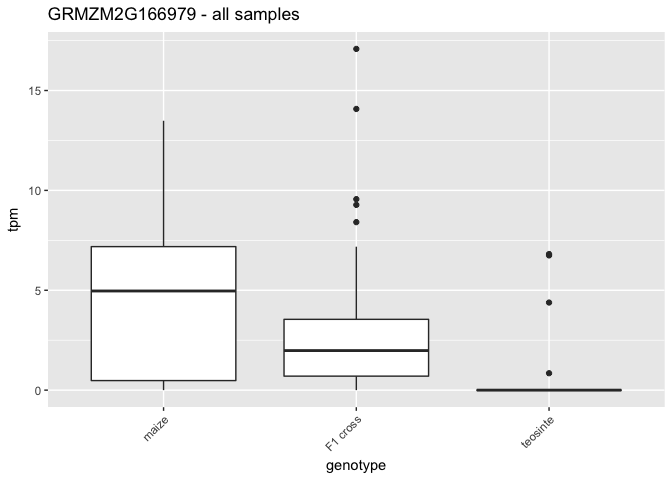
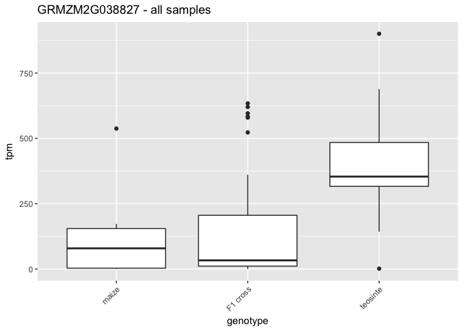

# env


```r
library(reshape2)
library(tidyverse)
library(gplots)
```


# data

Transcripts per Million, for each gene by each sample


```r
gene_tpm <- readRDS("gene_tpm.rds")
```

Make gene_tpm into a long data frame for plotting with ggplot


```r
tpm_long <- gene_tpm
tpm_long$gene <- rownames(tpm_long)
tpm_long <- reshape2::melt(tpm_long, id = "gene")
colnames(tpm_long) <- c("gene", "sample", "tpm")
```

I need the meta information about which sample is what


```r
meta <- read.table("../../SraRunTable.txt", header=T, sep="\t")
meta_leaf <- dplyr::filter(meta, tissue_s == "leaf")
meta_leaf <- dplyr::select(meta_leaf, sample=Run_s, cultivar=cultivar_s, genotype=genotype_s, tissue=tissue_s)
meta_leaf$genotype <- relevel(meta_leaf$genotype, ref="maize")
```

Order the samples based on the genotype order


```r
meta_leaf <- meta_leaf[order(meta_leaf$genotype),]
meta_leaf$sample <- factor(meta_leaf$sample, levels = meta_leaf$sample)
```


Join meta_leaf with the tpm_long data frame


```r
tpm_long <- tpm_long %>% left_join(meta_leaf, by="sample")
```

```
## Warning: Column `sample` joining factors with different levels, coercing to
## character vector
```

```r
head(tpm_long)
```

```
##         gene     sample       tpm  cultivar genotype tissue
## 1 AC148152.3 SRR1586766  36.74245 B73_TIL01 F1 cross   leaf
## 2 AC148167.6 SRR1586766 133.84700 B73_TIL01 F1 cross   leaf
## 3 AC149475.2 SRR1586766 245.04310 B73_TIL01 F1 cross   leaf
## 4 AC149810.2 SRR1586766  38.40671 B73_TIL01 F1 cross   leaf
## 5 AC149818.2 SRR1586766  70.30008 B73_TIL01 F1 cross   leaf
## 6 AC149828.2 SRR1586766  78.53433 B73_TIL01 F1 cross   leaf
```

```r
str(tpm_long)
```

```
## 'data.frame':	5848985 obs. of  6 variables:
##  $ gene    : chr  "AC148152.3" "AC148167.6" "AC149475.2" "AC149810.2" ...
##  $ sample  : chr  "SRR1586766" "SRR1586766" "SRR1586766" "SRR1586766" ...
##  $ tpm     : num  36.7 133.8 245 38.4 70.3 ...
##  $ cultivar: Factor w/ 46 levels "B73","B73_TIL01",..: 2 2 2 2 2 2 2 2 2 2 ...
##  $ genotype: Factor w/ 3 levels "maize","F1 cross",..: 2 2 2 2 2 2 2 2 2 2 ...
##  $ tissue  : Factor w/ 3 levels "ear","leaf","stem": 2 2 2 2 2 2 2 2 2 2 ...
```

reorder levels of genotype

Results from the limma analysis, by cultivar group


```r
res_bycult <- readRDS("bygroup_sig.rds")
res_bycult_both <- res_bycult %>% filter(de == "both")
```

Results from the limma analysis, by genotype


```r
res_bygeno <- readRDS("bygenotype_sig.rds")
res_bygeno_both <- res_bygeno %>% filter(de == "both")
```


Assign each cultivar to it's analysis group:


```r
contrast_groups <- list("B73_TIL01"=c("B73_TIL01","B73", "TIL01"),
                        "B73_TIL03"=c("B73_TIL03","B73", "TIL03"),
                        "B73_TIL05"=c("B73_TIL05","B73", "TIL05"),
                        "B73_TIL09"=c("B73_TIL09","B73", "TIL09"),
                        "B73_TIL11"=c("B73_TIL11","B73", "TIL11"),
                        "B73_TIL14"=c("B73_TIL14","B73", "TIL14"),
                        "B73_TIL25"=c("B73_TIL25","B73", "TIL25"),
                        "CML103_TIL03"=c("CML103_TIL03","CML103", "TIL03"),
                        "CML103_TIL11"=c("CML103_TIL11","CML103", "TIL11"),
                        "CML103_TIL14"=c("CML103_TIL14","CML103", "TIL14"),
                        "CML103_TIL25"=c("CML103_TIL25","CML103", "TIL25"),
                        "Ki3_TIL03"=c("Ki3_TIL03","Ki3", "TIL03"),
                        "Ki3_TIL09"=c("Ki3_TIL09","Ki3", "TIL09"),
                        "Ki3_TIL11"=c("Ki3_TIL11","Ki3", "TIL11"),
                        "Ki3_TIL14"=c("Ki3_TIL14","Ki3", "TIL14"),
                        "Mo17_TIL01"=c("Mo17_TIL01","Mo17", "TIL01"),
                        "Mo17_TIL09"=c("Mo17_TIL09","Mo17", "TIL09"),
                        "Mo17_TIL14"=c("Mo17_TIL14","Mo17", "TIL14"),
                        "Mo17_TIL25"=c("Mo17_TIL25","Mo17", "TIL25"),
                        "Oh43_TIL01"=c("Oh43_TIL01","Oh43", "TIL01"),
                        "Oh43_TIL03"=c("Oh43_TIL03","Oh43", "TIL03"),
                        "Oh43_TIL09"=c("Oh43_TIL09","Oh43", "TIL09"),
                        "Oh43_TIL10"=c("Oh43_TIL10","Oh43", "TIL10"),
                        "Oh43_TIL11"=c("Oh43_TIL11","Oh43", "TIL11"),
                        "Oh43_TIL15"=c("Oh43_TIL15","Oh43", "TIL15"),
                        "Oh43_TIL25"=c("Oh43_TIL25","Oh43", "TIL25"),
                        "W22_TIL01"=c("W22_TIL01","W22", "TIL01"),
                        "W22_TIL03"=c("W22_TIL03","W22", "TIL03"),
                        "W22_TIL11"=c("W22_TIL11","W22", "TIL11"),
                        "W22_TIL14"=c("W22_TIL14","W22", "TIL14"),
                        "W22_TIL25"=c("W22_TIL25","W22", "TIL25"))
```


# Functions


```r
plot_gene_tpm_cult <- function(gene_to_plot) {
  #gene is a character string
  
  # get group
  
  tpm_long %>% filter(gene == gene_to_plot) %>% ggplot() + 
    geom_box(aes(x=sample, y=tpm, fill=cultivar), stat = "identity") +
    theme(axis.text.x = element_text(angle = 45, hjust = 1)) + ggtitle(gene_to_plot)
}
```


# By Cultivar

Scatter plot of results


```r
res_bycult_both %>% ggplot(aes(x=logFC.x, y=logFC.y)) + geom_point(alpha = 0.1)
```

<!-- -->


```r
res_bycult_both %>% ggplot(aes(x=logFC.x, y=logFC.y, color=group)) + geom_point(alpha = 0.1)
```

<!-- -->

### Additive genes


```r
add1 <- res_bycult_both %>% filter((logFC.x > 0 & logFC.y < 0) | (logFC.x < 0 & logFC.y > 0))
add1 %>% ggplot(aes(x=logFC.x, y=logFC.y, color=group)) + geom_point(alpha = 0.1)
```

<!-- -->

GRMZM2G166979


```r
gene_to_plot <- "GRMZM2G166979"
add1 %>% filter(gene == gene_to_plot) %>% ggplot(aes(x=logFC.x, y=logFC.y, color=group)) + 
  geom_point() +
  ggtitle(paste(gene_to_plot, "log fold changes")) + 
  geom_vline(xintercept = 0) + geom_hline(yintercept = 0)
```

<!-- -->

```r
grps <- add1 %>% filter(gene == gene_to_plot) %>% select(group)
spec_cultivars <- as.vector(do.call(cbind, contrast_groups[c(which(names(contrast_groups) %in% grps[,1]))]))
#subset tpm_long for just those cultivars
tpm_gene_group <- tpm_long %>% filter(gene == gene_to_plot) %>% filter(cultivar %in% spec_cultivars)
tpm_gene_group %>% ggplot(aes(x=genotype, y=tpm)) + geom_boxplot() + theme(axis.text.x = element_text(angle = 45, hjust = 1)) + ggtitle(paste(gene_to_plot, "- significant samples"))
```

<!-- -->

```r
tpm_gene_group %>% ggplot(aes(x=genotype, y=tpm)) + geom_boxplot() + geom_jitter(aes(color=cultivar)) + theme(axis.text.x = element_text(angle = 45, hjust = 1)) + ggtitle(paste(gene_to_plot, "- significant samples"))
```

<!-- -->

```r
tpm_long %>% filter(gene == gene_to_plot) %>% ggplot(aes(x=genotype, y=tpm)) + geom_boxplot() + theme(axis.text.x = element_text(angle = 45, hjust = 1)) + ggtitle(paste(gene_to_plot, "- all samples"))
```

<!-- -->

GRMZM2G038827


```r
gene_to_plot <- "GRMZM2G038827"
add1 %>% filter(gene == gene_to_plot) %>% ggplot(aes(x=logFC.x, y=logFC.y, color=group)) + 
  geom_point() +
  ggtitle(paste(gene_to_plot, "log fold changes")) + 
  geom_vline(xintercept = 0) + geom_hline(yintercept = 0)
```

<!-- -->

```r
grps <- add1 %>% filter(gene == gene_to_plot) %>% select(group)
spec_cultivars <- as.vector(do.call(cbind, contrast_groups[c(which(names(contrast_groups) %in% grps[,1]))]))
#subset tpm_long for just those cultivars
tpm_gene_group <- tpm_long %>% filter(gene == gene_to_plot) %>% filter(cultivar %in% spec_cultivars)
tpm_gene_group %>% ggplot(aes(x=genotype, y=tpm)) + geom_boxplot() + theme(axis.text.x = element_text(angle = 45, hjust = 1)) + ggtitle(paste(gene_to_plot, "- significant samples"))
```

<!-- -->

```r
tpm_gene_group %>% ggplot(aes(x=genotype, y=tpm)) + geom_boxplot() + geom_jitter(aes(color=cultivar)) + theme(axis.text.x = element_text(angle = 45, hjust = 1)) + ggtitle(paste(gene_to_plot, "- significant samples"))
```

<!-- -->

```r
tpm_long %>% filter(gene == gene_to_plot) %>% ggplot(aes(x=genotype, y=tpm)) + geom_boxplot() + theme(axis.text.x = element_text(angle = 45, hjust = 1)) + ggtitle(paste(gene_to_plot, "- all samples"))
```

<!-- -->

GRMZM2G000288


```r
gene_to_plot <- "GRMZM2G000288"
add1 %>% filter(gene == gene_to_plot) %>% ggplot(aes(x=logFC.x, y=logFC.y, color=group)) + 
  geom_point() +
  ggtitle(paste(gene_to_plot, "log fold changes")) + 
  geom_vline(xintercept = 0) + geom_hline(yintercept = 0)
```

<!-- -->

```r
grps <- add1 %>% filter(gene == gene_to_plot) %>% select(group)
spec_cultivars <- as.vector(do.call(cbind, contrast_groups[c(which(names(contrast_groups) %in% grps[,1]))]))
#subset tpm_long for just those cultivars
tpm_gene_group <- tpm_long %>% filter(gene == gene_to_plot) %>% filter(cultivar %in% spec_cultivars)
tpm_gene_group %>% ggplot(aes(x=genotype, y=tpm)) + geom_boxplot() + theme(axis.text.x = element_text(angle = 45, hjust = 1)) + ggtitle(paste(gene_to_plot, "- significant samples"))
```

<!-- -->

```r
tpm_gene_group %>% ggplot(aes(x=genotype, y=tpm)) + geom_boxplot() + geom_jitter(aes(color=cultivar)) + theme(axis.text.x = element_text(angle = 45, hjust = 1)) + ggtitle(paste(gene_to_plot, "- significant samples"))
```

<!-- -->

```r
tpm_long %>% filter(gene == gene_to_plot) %>% ggplot(aes(x=genotype, y=tpm)) + geom_boxplot() + theme(axis.text.x = element_text(angle = 45, hjust = 1)) + ggtitle(paste(gene_to_plot, "- all samples"))
```

<!-- -->

### Over-dominant genes


```r
od <- res_bycult_both %>% filter(logFC.x < 0 & logFC.y < 0)
od %>% ggplot(aes(x=logFC.x, y=logFC.y, color=group)) + geom_point(alpha = 0.1)
```

<!-- -->

GRMZM2G003138


```r
gene_to_plot <- "GRMZM2G003138"
res_bycult_both %>% filter(gene == gene_to_plot) %>% ggplot(aes(x=logFC.x, y=logFC.y, color=group)) + geom_point() + 
  xlim(NA, 0) + ylim(NA, 0) +
  ggtitle(paste(gene_to_plot, "log fold changes")) + 
  geom_vline(xintercept = 0) + geom_hline(yintercept = 0)
```

<!-- -->

```r
grps <- res_bycult_both %>% filter(gene == gene_to_plot) %>% select(group)
spec_cultivars <- as.vector(do.call(cbind, contrast_groups[c(which(names(contrast_groups) %in% grps[,1]))]))
#subset tpm_long for just those cultivars
tpm_gene_group <- tpm_long %>% filter(gene == gene_to_plot) %>% filter(cultivar %in% spec_cultivars)
tpm_gene_group %>% ggplot(aes(x=genotype, y=tpm)) + geom_boxplot() + 
  theme(axis.text.x = element_text(angle = 45, hjust = 1)) + ggtitle(paste(gene_to_plot, "- significant samples"))
```

<!-- -->

```r
tpm_gene_group %>% ggplot(aes(x=genotype, y=tpm)) + geom_boxplot() + 
  geom_jitter(aes(color=cultivar)) + theme(axis.text.x = element_text(angle = 45, hjust = 1)) + ggtitle(paste(gene_to_plot, "- significant samples"))
```

<!-- -->

```r
tpm_long %>% filter(gene == gene_to_plot) %>% ggplot(aes(x=genotype, y=tpm)) + geom_violin() +
  theme(axis.text.x = element_text(angle = 45, hjust = 1)) + ggtitle(paste(gene_to_plot, "- all samples"))
```

<!-- -->

GRMZM2G307368


```r
gene_to_plot <- "GRMZM2G307368"
res_bycult_both %>% filter(gene == gene_to_plot) %>% ggplot(aes(x=logFC.x, y=logFC.y, color=group)) + geom_point() + 
  xlim(NA, 0) + ylim(NA, 0) +
  ggtitle(paste(gene_to_plot, "log fold changes")) + 
  geom_vline(xintercept = 0) + geom_hline(yintercept = 0)
```

<!-- -->

```r
res_bycult %>% filter(gene == gene_to_plot) %>% ggplot(aes(x=logFC.x, y=logFC.y, color=group)) + geom_jitter() + 
  ggtitle(paste(gene_to_plot, "log fold changes")) + 
  geom_vline(xintercept = 0) + geom_hline(yintercept = 0)
```

<!-- -->

```r
grps <- res_bycult_both %>% filter(gene == gene_to_plot) %>% select(group)
spec_cultivars <- as.vector(do.call(cbind, contrast_groups[c(which(names(contrast_groups) %in% grps[,1]))]))
#subset tpm_long for just those cultivars
tpm_gene_group <- tpm_long %>% filter(gene == gene_to_plot) %>% filter(cultivar %in% spec_cultivars)
tpm_gene_group %>% ggplot(aes(x=genotype, y=tpm)) + geom_boxplot() + 
  theme(axis.text.x = element_text(angle = 45, hjust = 1)) + ggtitle(paste(gene_to_plot, "- significant samples"))
```

<!-- -->

```r
tpm_gene_group %>% ggplot(aes(x=genotype, y=tpm)) + geom_boxplot() + 
  geom_jitter(aes(color=cultivar)) + theme(axis.text.x = element_text(angle = 45, hjust = 1)) + ggtitle(paste(gene_to_plot, "- significant samples"))
```

<!-- -->

```r
tpm_long %>% filter(gene == gene_to_plot) %>% ggplot(aes(x=genotype, y=tpm)) + geom_violin() +
  theme(axis.text.x = element_text(angle = 45, hjust = 1)) + ggtitle(paste(gene_to_plot, "- all samples"))
```

<!-- -->

### Under-dominant genes


```r
ud <- res_bycult_both %>% filter(logFC.x > 0 & logFC.y > 0)
ud %>% ggplot(aes(x=logFC.x, y=logFC.y, color=group)) + geom_point(alpha = 0.1)
```

<!-- -->


AC149475.2


```r
gene_to_plot <- "AC149475.2"
res_bycult_both %>% filter(gene == gene_to_plot) %>% ggplot(aes(x=logFC.x, y=logFC.y, color=group)) + geom_point() + 
  xlim(0, NA) + ylim(0, NA) +
  ggtitle(paste(gene_to_plot, "log fold changes"))
```

<!-- -->

```r
res_bycult %>% filter(gene == gene_to_plot) %>% ggplot(aes(x=logFC.x, y=logFC.y, color=group)) + geom_point() + 
  ggtitle(paste(gene_to_plot, "log fold changes"))
```

<!-- -->

```r
grps <- res_bycult_both %>% filter(gene == gene_to_plot) %>% select(group)
spec_cultivars <- as.vector(do.call(cbind, contrast_groups[c(which(names(contrast_groups) %in% grps[,1]))]))
#subset tpm_long for just those cultivars
tpm_gene_group <- tpm_long %>% filter(gene == gene_to_plot) %>% filter(cultivar %in% spec_cultivars)

tpm_gene_group %>% ggplot(aes(x=genotype, y=tpm)) + geom_boxplot() + theme(axis.text.x = element_text(angle = 45, hjust = 1)) + ggtitle(paste(gene_to_plot, "- significant samples"))
```

<!-- -->

```r
tpm_gene_group %>% ggplot(aes(x=genotype, y=tpm)) + geom_boxplot() + geom_jitter(aes(color=cultivar)) + theme(axis.text.x = element_text(angle = 45, hjust = 1)) + ggtitle(paste(gene_to_plot, "- significant samples"))
```

<!-- -->

```r
tpm_long %>% filter(gene == gene_to_plot) %>% ggplot(aes(x=genotype, y=tpm)) + geom_boxplot() + 
  geom_jitter(aes(color=cultivar)) +
  theme(axis.text.x = element_text(angle = 45, hjust = 1)) + ggtitle(paste(gene_to_plot, "- all samples"))
```

<!-- -->


GRMZM2G007729


```r
gene_to_plot <- "GRMZM2G007729"
res_bycult_both %>% filter(gene == gene_to_plot) %>% ggplot(aes(x=logFC.x, y=logFC.y, color=group)) + geom_point() + 
  xlim(0, NA) + ylim(0, NA) +
  ggtitle(paste(gene_to_plot, "log fold changes"))
```

<!-- -->

```r
res_bycult %>% filter(gene == gene_to_plot) %>% ggplot(aes(x=logFC.x, y=logFC.y, color=group)) + geom_point() + 
    xlim(0, NA) + ylim(0, NA) +
  ggtitle(paste(gene_to_plot, "log fold changes"))
```

<!-- -->

```r
grps <- res_bycult_both %>% filter(gene == gene_to_plot) %>% select(group)
spec_cultivars <- as.vector(do.call(cbind, contrast_groups[c(which(names(contrast_groups) %in% grps[,1]))]))
#subset tpm_long for just those cultivars
tpm_gene_group <- tpm_long %>% filter(gene == gene_to_plot) %>% filter(cultivar %in% spec_cultivars)
tpm_gene_group %>% ggplot(aes(x=genotype, y=tpm)) + geom_boxplot() + theme(axis.text.x = element_text(angle = 45, hjust = 1)) + ggtitle(paste(gene_to_plot, "- significant samples"))
```

<!-- -->

```r
tpm_gene_group %>% ggplot(aes(x=genotype, y=tpm)) + geom_boxplot() + geom_jitter(aes(color=cultivar)) + theme(axis.text.x = element_text(angle = 45, hjust = 1)) + ggtitle(paste(gene_to_plot, "- significant samples"))
```

<!-- -->

```r
tpm_long %>% filter(gene == gene_to_plot) %>% ggplot(aes(x=genotype, y=tpm)) + geom_boxplot() + 
  geom_jitter(aes(color=cultivar)) +
  theme(axis.text.x = element_text(angle = 45, hjust = 1)) + ggtitle(paste(gene_to_plot, "- all samples"))
```

<!-- -->

### GO term enrichment in dis-regulated genes


```r
library(topGO)
#agrigo <- read.table("~/Box Sync/Projects/GOmaize/db/maize_v3.agrigo.f.db", header=F, sep="\t")
#argot <- read.table("~/Box Sync/Projects/GOmaize/db/maize_v3.argot2.f.db", header=F, sep="\t")
```


```r
gene_universe <- rownames(gene_tpm)
maize.gene2GO <- readMappings(file = "~/Box Sync/Projects/GOmaize/db/maize.agrigo.all.f.db")
agrigo.gene2GO <- readMappings(file= "~/Box Sync/Projects/GOmaize/db/maize_v3.agrigo.f.db")
```

Test for enriched GO terms for overdominant genes

Create a names list of either 1 or 0 for genes that are overdominant or not.


```r
od_genes <- unique(od$gene)
geneList <- rep(0, dim(gene_tpm)[1])
names(geneList) <- rownames(gene_tpm)
for (i in 1:length(geneList)) {
  if(names(geneList)[i] %in% od_genes) {
    geneList[i] <- 1
  }
}
sum(geneList)
```

```
## [1] 10495
```

```r
geneList <- as.factor(geneList)
```

Creat topGo object and run Fisher test


```r
od_godata <- new("topGOdata", ontology = "MF",
                 allGenes = geneList,
                 annot = annFUN.gene2GO, gene2GO = maize.gene2GO)
```

```
## 
## Building most specific GOs .....
```

```
## 	( 316 GO terms found. )
```

```
## 
## Build GO DAG topology ..........
```

```
## 	( 594 GO terms and 728 relations. )
```

```
## 
## Annotating nodes ...............
```

```
## 	( 8551 genes annotated to the GO terms. )
```

```r
result_fisher <- runTest(od_godata, algorithm = "classic", statistic = "fisher")
```

```
## 
## 			 -- Classic Algorithm -- 
## 
## 		 the algorithm is scoring 437 nontrivial nodes
## 		 parameters: 
## 			 test statistic: fisher
```

```r
od_MF <- GenTable(od_godata, classicFisher = result_fisher, 
                     orderBy = "classicFisher",
                     ranksOf = "classicFisher",
                     topNodes = 20)
od_MF
```

```
##         GO.ID                                        Term Annotated
## 1  GO:0016491                     oxidoreductase activity       842
## 2  GO:0003824                          catalytic activity      4060
## 3  GO:0004497                      monooxygenase activity       257
## 4  GO:0016829                              lyase activity        90
## 5  GO:0030410             nicotianamine synthase activity         9
## 6  GO:0004857                   enzyme inhibitor activity        94
## 7  GO:0030234                   enzyme regulator activity       108
## 8  GO:0016765 transferase activity, transferring alkyl...        36
## 9  GO:0004866            endopeptidase inhibitor activity        34
## 10 GO:0030414                peptidase inhibitor activity        34
## 11 GO:0061134                peptidase regulator activity        34
## 12 GO:0061135            endopeptidase regulator activity        34
## 13 GO:0008236              serine-type peptidase activity       125
## 14 GO:0017171                   serine hydrolase activity       125
## 15 GO:0009055                   electron carrier activity       186
## 16 GO:0004867 serine-type endopeptidase inhibitor acti...        25
## 17 GO:0008233                          peptidase activity       311
## 18 GO:0070011 peptidase activity, acting on L-amino ac...       311
## 19 GO:0016835                carbon-oxygen lyase activity        29
## 20 GO:0016836                        hydro-lyase activity        22
##    Significant Expected classicFisher
## 1          307   220.27       2.5e-12
## 2         1196  1062.12       2.5e-11
## 3          112    67.23       6.4e-10
## 4           45    23.54       1.0e-06
## 5            9     2.35       5.7e-06
## 6           44    24.59       1.2e-05
## 7           48    28.25       2.8e-05
## 8           21     9.42       4.4e-05
## 9           19     8.89       0.00022
## 10          19     8.89       0.00022
## 11          19     8.89       0.00022
## 12          19     8.89       0.00022
## 13          51    32.70       0.00023
## 14          51    32.70       0.00023
## 15          70    48.66       0.00034
## 16          15     6.54       0.00036
## 17         107    81.36       0.00064
## 18         107    81.36       0.00064
## 19          16     7.59       0.00084
## 20          13     5.76       0.00110
```

GO terms for underdominant genes


```r
ud_genes <- unique(ud$gene)
geneList <- rep(0, dim(gene_tpm)[1])
names(geneList) <- rownames(gene_tpm)
for (i in 1:length(geneList)) {
  if(names(geneList)[i] %in% ud_genes) {
    geneList[i] <- 1
  }
}
sum(geneList)
```

```
## [1] 4519
```

```r
geneList <- as.factor(geneList)

ud_godata <- new("topGOdata", ontology = "MF",
                 allGenes = geneList,
                 annot = annFUN.gene2GO, gene2GO = maize.gene2GO)
```

```
## 
## Building most specific GOs .....
```

```
## 	( 316 GO terms found. )
```

```
## 
## Build GO DAG topology ..........
```

```
## 	( 594 GO terms and 728 relations. )
```

```
## 
## Annotating nodes ...............
```

```
## 	( 8551 genes annotated to the GO terms. )
```

```r
result_fisher <- runTest(ud_godata, algorithm = "classic", statistic = "fisher")
```

```
## 
## 			 -- Classic Algorithm -- 
## 
## 		 the algorithm is scoring 319 nontrivial nodes
## 		 parameters: 
## 			 test statistic: fisher
```

```r
ud_MF <- GenTable(ud_godata, classicFisher = result_fisher, 
                     orderBy = "classicFisher",
                     ranksOf = "classicFisher",
                     topNodes = 20)
ud_MF
```

```
##         GO.ID                                        Term Annotated
## 1  GO:0005198                structural molecule activity       374
## 2  GO:0003735          structural constituent of ribosome       332
## 3  GO:0017111          nucleoside-triphosphatase activity       181
## 4  GO:0016462                    pyrophosphatase activity       192
## 5  GO:0016817 hydrolase activity, acting on acid anhyd...       192
## 6  GO:0016818 hydrolase activity, acting on acid anhyd...       192
## 7  GO:0005488                                     binding      2749
## 8  GO:0097159             organic cyclic compound binding      1777
## 9  GO:1901363               heterocyclic compound binding      1777
## 10 GO:0003676                        nucleic acid binding      1249
## 11 GO:0003777                  microtubule motor activity        63
## 12 GO:0004576         oligosaccharyl transferase activity         9
## 13 GO:0003924                             GTPase activity        86
## 14 GO:0003774                              motor activity        76
## 15 GO:0003677                                 DNA binding       565
## 16 GO:0003746      translation elongation factor activity        10
## 17 GO:0004579 dolichyl-diphosphooligosaccharide-protei...         6
## 18 GO:0003723                                 RNA binding       231
## 19 GO:0008135    translation factor activity, RNA binding        40
## 20 GO:0005515                             protein binding       524
##    Significant Expected classicFisher
## 1          166    65.17       < 1e-30
## 2          149    57.85       < 1e-30
## 3           74    31.54       5.4e-14
## 4           76    33.46       1.8e-13
## 5           76    33.46       1.8e-13
## 6           76    33.46       1.8e-13
## 7          594   479.01       2.7e-12
## 8          400   309.64       3.5e-10
## 9          400   309.64       3.5e-10
## 10         296   217.64       5.9e-10
## 11          31    10.98       6.4e-09
## 12           9     1.57       1.5e-07
## 13          35    14.99       2.9e-07
## 14          31    13.24       1.3e-06
## 15         139    98.45       5.1e-06
## 16           8     1.74       2.7e-05
## 17           6     1.05       2.8e-05
## 18          61    40.25       0.00035
## 19          16     6.97       0.00062
## 20         119    91.31       0.00085
```

GO terms for the additive genes


```r
add_genes <- unique(add1$gene)
geneList <- rep(0, dim(gene_tpm)[1])
names(geneList) <- rownames(gene_tpm)
for (i in 1:length(geneList)) {
  if(names(geneList)[i] %in% add_genes) {
    geneList[i] <- 1
  }
}
sum(geneList)
```

```
## [1] 936
```

```r
geneList <- as.factor(geneList)

add_godata <- new("topGOdata", ontology = "MF",
                 allGenes = geneList,
                 annot = annFUN.gene2GO, gene2GO = maize.gene2GO)
```

```
## 
## Building most specific GOs .....
```

```
## 	( 316 GO terms found. )
```

```
## 
## Build GO DAG topology ..........
```

```
## 	( 594 GO terms and 728 relations. )
```

```
## 
## Annotating nodes ...............
```

```
## 	( 8551 genes annotated to the GO terms. )
```

```r
result_fisher <- runTest(add_godata, algorithm = "classic", statistic = "fisher")
```

```
## 
## 			 -- Classic Algorithm -- 
## 
## 		 the algorithm is scoring 180 nontrivial nodes
## 		 parameters: 
## 			 test statistic: fisher
```

```r
add_MF <- GenTable(add_godata, classicFisher = result_fisher, 
                     orderBy = "classicFisher",
                     ranksOf = "classicFisher",
                     topNodes = 20)
add_MF
```

```
##         GO.ID                                        Term Annotated
## 1  GO:0004807         triose-phosphate isomerase activity        11
## 2  GO:0000175              3'-5'-exoribonuclease activity        13
## 3  GO:0004527                        exonuclease activity        13
## 4  GO:0004532                    exoribonuclease activity        13
## 5  GO:0008408                  3'-5' exonuclease activity        13
## 6  GO:0016796 exonuclease activity, active with either...        13
## 7  GO:0016896 exoribonuclease activity, producing 5'-p...        13
## 8  GO:0016853                          isomerase activity        80
## 9  GO:0004540                       ribonuclease activity        16
## 10 GO:0016860      intramolecular oxidoreductase activity        19
## 11 GO:0016861 intramolecular oxidoreductase activity, ...        19
## 12 GO:0005198                structural molecule activity       374
## 13 GO:0003735          structural constituent of ribosome       332
## 14 GO:0004518                           nuclease activity        32
## 15 GO:0004427            inorganic diphosphatase activity        11
## 16 GO:0004555              alpha,alpha-trehalase activity         1
## 17 GO:0015205 nucleobase transmembrane transporter act...         1
## 18 GO:0015927                          trehalase activity         1
## 19 GO:0016874                             ligase activity        64
## 20 GO:0016788 hydrolase activity, acting on ester bond...       102
##    Significant Expected classicFisher
## 1            4     0.22       4.8e-05
## 2            4     0.26       0.00010
## 3            4     0.26       0.00010
## 4            4     0.26       0.00010
## 5            4     0.26       0.00010
## 6            4     0.26       0.00010
## 7            4     0.26       0.00010
## 8            8     1.62       0.00020
## 9            4     0.32       0.00024
## 10           4     0.38       0.00049
## 11           4     0.38       0.00049
## 12          17     7.57       0.00146
## 13          15     6.72       0.00294
## 14           4     0.65       0.00374
## 15           2     0.22       0.01985
## 16           1     0.02       0.02023
## 17           1     0.02       0.02023
## 18           1     0.02       0.02023
## 19           4     1.29       0.04023
## 20           5     2.06       0.05557
```


# By Genotype

By either maize, teosinte, or F1, with no distinction between cultivars


```r
res_bygeno_both %>% ggplot(aes(x=logFC.x, y=logFC.y)) + geom_point(alpha = 0.1)
```

<!-- -->

### Additive genes


```r
additive <- res_bygeno_both %>% filter((logFC.x > 0 & logFC.y < 0) | (logFC.x < 0 & logFC.y > 0))
additive %>% ggplot(aes(x=logFC.x, y=logFC.y)) + geom_point(alpha = 0.1)
```

<!-- -->

GRMZM2G029039


```r
gene_to_plot <- "GRMZM2G037500"
res_bygeno_both %>% filter(gene == gene_to_plot) %>% ggplot(aes(x=logFC.x, y=logFC.y)) + 
  geom_point() +
  ggtitle(paste(gene_to_plot, "log fold changes")) + 
  geom_vline(xintercept = 0) + geom_hline(yintercept = 0)
```

<!-- -->

```r
#spec_cultivars <- as.vector(do.call(cbind, contrast_groups[c(which(names(contrast_groups) %in% grps[,1]))]))
#subset tpm_long for just those cultivars
tpm_goi <- tpm_long %>% filter(gene == gene_to_plot)
tpm_goi %>% ggplot(aes(x=genotype, y=tpm)) + geom_boxplot() + geom_jitter(aes(color=cultivar)) + theme(axis.text.x = element_text(angle = 45, hjust = 1)) + ggtitle(paste(gene_to_plot, "- significant samples"))
```

<!-- -->

```r
tpm_long %>% filter(gene == gene_to_plot) %>% ggplot(aes(x=genotype, y=tpm)) + geom_boxplot() + theme(axis.text.x = element_text(angle = 45, hjust = 1)) + ggtitle(paste(gene_to_plot, "- all samples"))
```

<!-- -->

GRMZM2G162388


```r
gene_to_plot <- "GRMZM2G162388"
res_bygeno_both %>% filter(gene == gene_to_plot) %>% ggplot(aes(x=logFC.x, y=logFC.y)) + 
  geom_point() +
  ggtitle(paste(gene_to_plot, "log fold changes")) + 
  geom_vline(xintercept = 0) + geom_hline(yintercept = 0)
```

<!-- -->

```r
#spec_cultivars <- as.vector(do.call(cbind, contrast_groups[c(which(names(contrast_groups) %in% grps[,1]))]))
#subset tpm_long for just those cultivars
tpm_goi <- tpm_long %>% filter(gene == gene_to_plot)
tpm_goi %>% ggplot(aes(x=genotype, y=tpm)) + geom_boxplot() + geom_jitter(aes(color=cultivar)) + theme(axis.text.x = element_text(angle = 45, hjust = 1)) + ggtitle(paste(gene_to_plot, "- all samples"))
```

<!-- -->

```r
tpm_long %>% filter(gene == gene_to_plot) %>% ggplot(aes(x=genotype, y=tpm)) + geom_boxplot() + theme(axis.text.x = element_text(angle = 45, hjust = 1)) + ggtitle(paste(gene_to_plot, "- all samples"))
```

<!-- -->

### Overdominant genes


```r
od_geno <- res_bygeno_both %>% filter(logFC.x < 0 & logFC.y < 0)
od_geno %>% ggplot(aes(x=logFC.x, y=logFC.y)) + geom_point(alpha = 0.1)
```

<!-- -->

GRMZM2G070011


```r
gene_to_plot <- "GRMZM2G070011"
res_bygeno_both %>% filter(gene == gene_to_plot) %>% ggplot(aes(x=logFC.x, y=logFC.y)) + 
  geom_point() +
  ggtitle(paste(gene_to_plot, "log fold changes")) + 
  geom_vline(xintercept = 0) + geom_hline(yintercept = 0)
```

<!-- -->

```r
#spec_cultivars <- as.vector(do.call(cbind, contrast_groups[c(which(names(contrast_groups) %in% grps[,1]))]))
#subset tpm_long for just those cultivars
tpm_goi <- tpm_long %>% filter(gene == gene_to_plot)
tpm_goi %>% ggplot(aes(x=genotype, y=tpm)) + geom_boxplot() + geom_jitter(aes(color=cultivar)) + theme(axis.text.x = element_text(angle = 45, hjust = 1)) + ggtitle(paste(gene_to_plot, "- all samples"))
```

<!-- -->

```r
tpm_long %>% filter(gene == gene_to_plot) %>% ggplot(aes(x=genotype, y=tpm)) + geom_boxplot() + theme(axis.text.x = element_text(angle = 45, hjust = 1)) + ggtitle(paste(gene_to_plot, "- all samples"))
```

<!-- -->

GRMZM2G025832


```r
gene_to_plot <- "GRMZM2G025832"
res_bygeno_both %>% filter(gene == gene_to_plot) %>% ggplot(aes(x=logFC.x, y=logFC.y)) + 
  geom_point() +
  ggtitle(paste(gene_to_plot, "log fold changes")) + 
  geom_vline(xintercept = 0) + geom_hline(yintercept = 0)
```

<!-- -->

```r
#spec_cultivars <- as.vector(do.call(cbind, contrast_groups[c(which(names(contrast_groups) %in% grps[,1]))]))
#subset tpm_long for just those cultivars
tpm_goi <- tpm_long %>% filter(gene == gene_to_plot)
tpm_goi %>% ggplot(aes(x=genotype, y=tpm)) + geom_boxplot() + geom_jitter(aes(color=cultivar)) + theme(axis.text.x = element_text(angle = 45, hjust = 1)) + ggtitle(paste(gene_to_plot, "- all samples"))
```

<!-- -->

```r
tpm_long %>% filter(gene == gene_to_plot) %>% ggplot(aes(x=genotype, y=tpm)) + geom_boxplot() + theme(axis.text.x = element_text(angle = 45, hjust = 1)) + ggtitle(paste(gene_to_plot, "- all samples"))
```

<!-- -->

### Underdominant genes


```r
ud_geno <- res_bygeno_both %>% filter(logFC.x > 0 & logFC.y > 0)
ud_geno %>% ggplot(aes(x=logFC.x, y=logFC.y)) + geom_point(alpha = 0.1)
```

<!-- -->

GRMZM2G087809


```r
gene_to_plot <- "GRMZM2G087809"
res_bygeno_both %>% filter(gene == gene_to_plot) %>% ggplot(aes(x=logFC.x, y=logFC.y)) + 
  geom_point() +
  ggtitle(paste(gene_to_plot, "log fold changes")) + 
  geom_vline(xintercept = 0) + geom_hline(yintercept = 0)
```

<!-- -->

```r
#spec_cultivars <- as.vector(do.call(cbind, contrast_groups[c(which(names(contrast_groups) %in% grps[,1]))]))
#subset tpm_long for just those cultivars
tpm_goi <- tpm_long %>% filter(gene == gene_to_plot)
tpm_goi %>% ggplot(aes(x=genotype, y=tpm)) + geom_boxplot() + geom_jitter(aes(color=cultivar)) + theme(axis.text.x = element_text(angle = 45, hjust = 1)) + ggtitle(paste(gene_to_plot, "- all samples"))
```

<!-- -->

```r
tpm_long %>% filter(gene == gene_to_plot) %>% ggplot(aes(x=genotype, y=tpm)) + geom_boxplot() + theme(axis.text.x = element_text(angle = 45, hjust = 1)) + ggtitle(paste(gene_to_plot, "- all samples"))
```

<!-- -->

GRMZM2G033555

```r
gene_to_plot <- "GRMZM2G033555"
res_bygeno_both %>% filter(gene == gene_to_plot) %>% ggplot(aes(x=logFC.x, y=logFC.y)) + 
  geom_point() +
  ggtitle(paste(gene_to_plot, "log fold changes")) + 
  geom_vline(xintercept = 0) + geom_hline(yintercept = 0)
```

<!-- -->

```r
#spec_cultivars <- as.vector(do.call(cbind, contrast_groups[c(which(names(contrast_groups) %in% grps[,1]))]))
#subset tpm_long for just those cultivars
tpm_goi <- tpm_long %>% filter(gene == gene_to_plot)
tpm_goi %>% ggplot(aes(x=genotype, y=tpm)) + geom_boxplot() + geom_jitter(aes(color=cultivar)) + theme(axis.text.x = element_text(angle = 45, hjust = 1)) + ggtitle(paste(gene_to_plot, "- all samples"))
```

<!-- -->

```r
tpm_long %>% filter(gene == gene_to_plot) %>% ggplot(aes(x=genotype, y=tpm)) + geom_boxplot() + theme(axis.text.x = element_text(angle = 45, hjust = 1)) + ggtitle(paste(gene_to_plot, "- all samples"))
```

<!-- -->

GRMZM2G104610


```r
gene_to_plot <- "GRMZM2G104610"
res_bygeno_both %>% filter(gene == gene_to_plot) %>% ggplot(aes(x=logFC.x, y=logFC.y)) + 
  geom_point() +
  ggtitle(paste(gene_to_plot, "log fold changes")) + 
  geom_vline(xintercept = 0) + geom_hline(yintercept = 0)
```

<!-- -->

```r
#spec_cultivars <- as.vector(do.call(cbind, contrast_groups[c(which(names(contrast_groups) %in% grps[,1]))]))
#subset tpm_long for just those cultivars
tpm_goi <- tpm_long %>% filter(gene == gene_to_plot)
tpm_goi %>% ggplot(aes(x=genotype, y=tpm)) + geom_boxplot() + geom_jitter(aes(color=cultivar)) + theme(axis.text.x = element_text(angle = 45, hjust = 1)) + ggtitle(paste(gene_to_plot, "- all samples"))
```

<!-- -->

```r
tpm_long %>% filter(gene == gene_to_plot) %>% ggplot(aes(x=genotype, y=tpm)) + geom_boxplot() + theme(axis.text.x = element_text(angle = 45, hjust = 1)) + ggtitle(paste(gene_to_plot, "- all samples"))
```

<!-- -->

```r
tpm_long %>% filter(gene == gene_to_plot) %>% ggplot(aes(x=sample, y=tpm, fill=genotype)) + geom_bar(stat = "identity") + theme(axis.text.x = element_text(angle = 45, hjust = 1)) + ggtitle(paste(gene_to_plot, "- all samples"))
```

<!-- -->

GRMZM2G139565


```r
gene_to_plot <- "GRMZM2G139565"
res_bygeno_both %>% filter(gene == gene_to_plot) %>% ggplot(aes(x=logFC.x, y=logFC.y)) + 
  geom_point() +
  ggtitle(paste(gene_to_plot, "log fold changes")) + 
  geom_vline(xintercept = 0) + geom_hline(yintercept = 0)
```

<!-- -->

```r
#spec_cultivars <- as.vector(do.call(cbind, contrast_groups[c(which(names(contrast_groups) %in% grps[,1]))]))
#subset tpm_long for just those cultivars
tpm_goi <- tpm_long %>% filter(gene == gene_to_plot)
tpm_goi %>% ggplot(aes(x=genotype, y=tpm)) + geom_boxplot() + geom_jitter(aes(color=cultivar)) + theme(axis.text.x = element_text(angle = 45, hjust = 1)) + ggtitle(paste(gene_to_plot, "- all samples"))
```

<!-- -->

```r
tpm_long %>% filter(gene == gene_to_plot) %>% ggplot(aes(x=genotype, y=tpm)) + geom_boxplot() + theme(axis.text.x = element_text(angle = 45, hjust = 1)) + ggtitle(paste(gene_to_plot, "- all samples"))
```

<!-- -->

```r
tpm_long %>% filter(gene == gene_to_plot) %>% ggplot(aes(x=sample, y=tpm, fill=genotype)) + geom_bar(stat = "identity") + theme(axis.text.x = element_text(angle = 45, hjust = 1)) + ggtitle(paste(gene_to_plot, "- all samples"))
```

<!-- -->


### GO terms for gene categories

Over dominant


```r
od_geno_genes <- unique(od_geno$gene)
geneList <- rep(0, dim(gene_tpm)[1])
names(geneList) <- rownames(gene_tpm)
for (i in 1:length(geneList)) {
  if(names(geneList)[i] %in% od_geno_genes) {
    geneList[i] <- 1
  }
}
sum(geneList)
```

```
## [1] 2243
```

```r
geneList <- as.factor(geneList)

od_geno_godata <- new("topGOdata", ontology = "MF",
                 allGenes = geneList,
                 annot = annFUN.gene2GO, gene2GO = maize.gene2GO)
```

```
## 
## Building most specific GOs .....
```

```
## 	( 316 GO terms found. )
```

```
## 
## Build GO DAG topology ..........
```

```
## 	( 594 GO terms and 728 relations. )
```

```
## 
## Annotating nodes ...............
```

```
## 	( 8551 genes annotated to the GO terms. )
```

```r
result_fisher <- runTest(od_geno_godata, algorithm = "classic", statistic = "fisher")
```

```
## 
## 			 -- Classic Algorithm -- 
## 
## 		 the algorithm is scoring 256 nontrivial nodes
## 		 parameters: 
## 			 test statistic: fisher
```

```r
od_geno_MF <- GenTable(od_geno_godata, classicFisher = result_fisher, 
                     orderBy = "classicFisher",
                     ranksOf = "classicFisher",
                     topNodes = 20)
od_geno_MF
```

```
##         GO.ID                                        Term Annotated
## 1  GO:0004497                      monooxygenase activity       257
## 2  GO:0004089              carbonate dehydratase activity         5
## 3  GO:0016836                        hydro-lyase activity        22
## 4  GO:0016491                     oxidoreductase activity       842
## 5  GO:0016829                              lyase activity        90
## 6  GO:0003824                          catalytic activity      4060
## 7  GO:0016835                carbon-oxygen lyase activity        29
## 8  GO:0001071 nucleic acid binding transcription facto...       615
## 9  GO:0003700 transcription factor activity, sequence-...       615
## 10 GO:0008238                       exopeptidase activity        53
## 11 GO:0004645                      phosphorylase activity         2
## 12 GO:0000156    phosphorelay response regulator activity        29
## 13 GO:0004185       serine-type carboxypeptidase activity        44
## 14 GO:0052689         carboxylic ester hydrolase activity        44
## 15 GO:0070008           serine-type exopeptidase activity        44
## 16 GO:0004806                triglyceride lipase activity        38
## 17 GO:0004180                   carboxypeptidase activity        46
## 18 GO:0008757 S-adenosylmethionine-dependent methyltra...         7
## 19 GO:0008080                N-acetyltransferase activity        34
## 20 GO:0016407                  acetyltransferase activity        34
##    Significant Expected classicFisher
## 1           48    20.47       1.6e-08
## 2            5     0.40       3.2e-06
## 3            8     1.75       0.00018
## 4           95    67.06       0.00022
## 5           17     7.17       0.00064
## 6          362   323.34       0.00114
## 7            8     2.31       0.00148
## 8           69    48.98       0.00192
## 9           69    48.98       0.00192
## 10          11     4.22       0.00261
## 11           2     0.16       0.00633
## 12           7     2.31       0.00652
## 13           9     3.50       0.00690
## 14           9     3.50       0.00690
## 15           9     3.50       0.00690
## 16           8     3.03       0.00890
## 17           9     3.66       0.00929
## 18           3     0.56       0.01380
## 19           7     2.71       0.01590
## 20           7     2.71       0.01590
```

Underdominant


```r
ud_geno_genes <- unique(ud_geno$gene)
geneList <- rep(0, dim(gene_tpm)[1])
names(geneList) <- rownames(gene_tpm)
for (i in 1:length(geneList)) {
  if(names(geneList)[i] %in% ud_geno_genes) {
    geneList[i] <- 1
  }
}
sum(geneList)
```

```
## [1] 1289
```

```r
geneList <- as.factor(geneList)

ud_geno_godata <- new("topGOdata", ontology = "MF",
                 allGenes = geneList,
                 annot = annFUN.gene2GO, gene2GO = maize.gene2GO)
```

```
## 
## Building most specific GOs .....
```

```
## 	( 316 GO terms found. )
```

```
## 
## Build GO DAG topology ..........
```

```
## 	( 594 GO terms and 728 relations. )
```

```
## 
## Annotating nodes ...............
```

```
## 	( 8551 genes annotated to the GO terms. )
```

```r
result_fisher <- runTest(ud_geno_godata, algorithm = "classic", statistic = "fisher")
```

```
## 
## 			 -- Classic Algorithm -- 
## 
## 		 the algorithm is scoring 153 nontrivial nodes
## 		 parameters: 
## 			 test statistic: fisher
```

```r
ud_geno_MF <- GenTable(ud_geno_godata, classicFisher = result_fisher, 
                     orderBy = "classicFisher",
                     ranksOf = "classicFisher",
                     topNodes = 20)
ud_geno_MF
```

```
##         GO.ID                                        Term Annotated
## 1  GO:0004576         oligosaccharyl transferase activity         9
## 2  GO:0004579 dolichyl-diphosphooligosaccharide-protei...         6
## 3  GO:0005515                             protein binding       524
## 4  GO:0016757 transferase activity, transferring glyco...       139
## 5  GO:0004553 hydrolase activity, hydrolyzing O-glycos...       295
## 6  GO:0016798 hydrolase activity, acting on glycosyl b...       295
## 7  GO:0004500        dopamine beta-monooxygenase activity         3
## 8  GO:0016715 oxidoreductase activity, acting on paire...         3
## 9  GO:0016758 transferase activity, transferring hexos...        60
## 10 GO:0005507                          copper ion binding        96
## 11 GO:0004298       threonine-type endopeptidase activity        26
## 12 GO:0070003           threonine-type peptidase activity        26
## 13 GO:0004713            protein tyrosine kinase activity      1054
## 14 GO:0016740                        transferase activity      1689
## 15 GO:0004190        aspartic-type endopeptidase activity        77
## 16 GO:0070001            aspartic-type peptidase activity        77
## 17 GO:0016787                          hydrolase activity      1015
## 18 GO:0004650                  polygalacturonase activity        49
## 19 GO:0003848 2-amino-4-hydroxy-6-hydroxymethyldihydro...         1
## 20 GO:0004930         G-protein coupled receptor activity         1
##    Significant Expected classicFisher
## 1            5     0.34       8.3e-06
## 2            4     0.23       2.8e-05
## 3           37    19.79       0.00016
## 4           14     5.25       0.00075
## 5           22    11.14       0.00176
## 6           22    11.14       0.00176
## 7            2     0.11       0.00416
## 8            2     0.11       0.00416
## 9            7     2.27       0.00712
## 10           9     3.63       0.01014
## 11           4     0.98       0.01548
## 12           4     0.98       0.01548
## 13          53    39.81       0.01686
## 14          79    63.80       0.01997
## 15           7     2.91       0.02581
## 16           7     2.91       0.02581
## 17          50    38.34       0.02830
## 18           5     1.85       0.03658
## 19           1     0.04       0.03777
## 20           1     0.04       0.03777
```

Additive Genes


```r
add_geno_genes <- unique(additive$gene)
geneList <- rep(0, dim(gene_tpm)[1])
names(geneList) <- rownames(gene_tpm)
for (i in 1:length(geneList)) {
  if(names(geneList)[i] %in% add_geno_genes) {
    geneList[i] <- 1
  }
}
sum(geneList)
```

```
## [1] 128
```

```r
geneList <- as.factor(geneList)

add_geno_godata <- new("topGOdata", ontology = "MF",
                 allGenes = geneList,
                 annot = annFUN.gene2GO, gene2GO = maize.gene2GO)
```

```
## 
## Building most specific GOs .....
```

```
## 	( 316 GO terms found. )
```

```
## 
## Build GO DAG topology ..........
```

```
## 	( 594 GO terms and 728 relations. )
```

```
## 
## Annotating nodes ...............
```

```
## 	( 8551 genes annotated to the GO terms. )
```

```r
result_fisher <- runTest(add_geno_godata, algorithm = "classic", statistic = "fisher")
```

```
## 
## 			 -- Classic Algorithm -- 
## 
## 		 the algorithm is scoring 53 nontrivial nodes
## 		 parameters: 
## 			 test statistic: fisher
```

```r
add_geno_MF <- GenTable(add_geno_godata, classicFisher = result_fisher, 
                     orderBy = "classicFisher",
                     ranksOf = "classicFisher",
                     topNodes = 20)
add_geno_MF
```

```
##         GO.ID                                        Term Annotated
## 1  GO:0003824                          catalytic activity      4060
## 2  GO:0016853                          isomerase activity        80
## 3  GO:0004559                  alpha-mannosidase activity         8
## 4  GO:0015923                        mannosidase activity         8
## 5  GO:0004807         triose-phosphate isomerase activity        11
## 6  GO:0004365 glyceraldehyde-3-phosphate dehydrogenase...        14
## 7  GO:0016620 oxidoreductase activity, acting on the a...        14
## 8  GO:0016903 oxidoreductase activity, acting on the a...        14
## 9  GO:0043891 glyceraldehyde-3-phosphate dehydrogenase...        14
## 10 GO:0016860      intramolecular oxidoreductase activity        19
## 11 GO:0016861 intramolecular oxidoreductase activity, ...        19
## 12 GO:0004812              aminoacyl-tRNA ligase activity        29
## 13 GO:0016875 ligase activity, forming carbon-oxygen b...        29
## 14 GO:0016876 ligase activity, forming aminoacyl-tRNA ...        29
## 15 GO:0003755 peptidyl-prolyl cis-trans isomerase acti...        30
## 16 GO:0016859                cis-trans isomerase activity        30
## 17 GO:0019787 ubiquitin-like protein transferase activ...        61
## 18 GO:0003777                  microtubule motor activity        63
## 19 GO:0016874                             ligase activity        64
## 20 GO:0003774                              motor activity        76
##    Significant Expected classicFisher
## 1           14     8.55        0.0088
## 2            2     0.17        0.0120
## 3            1     0.02        0.0167
## 4            1     0.02        0.0167
## 5            1     0.02        0.0229
## 6            1     0.03        0.0291
## 7            1     0.03        0.0291
## 8            1     0.03        0.0291
## 9            1     0.03        0.0291
## 10           1     0.04        0.0393
## 11           1     0.04        0.0393
## 12           1     0.06        0.0594
## 13           1     0.06        0.0594
## 14           1     0.06        0.0594
## 15           1     0.06        0.0614
## 16           1     0.06        0.0614
## 17           1     0.13        0.1210
## 18           1     0.13        0.1247
## 19           1     0.13        0.1266
## 20           1     0.16        0.1486
```

# Clustering and heatmaps - by cultivar

### Heatmap for underdominant genes

subset the wide tpm data frame for just the underdominant genes

```r
ud_tpm <- gene_tpm[rownames(gene_tpm) %in% ud$gene,]
ud_tpm_long <- tpm_long[tpm_long$gene %in% ud$gene,]
dim(ud_tpm); dim(ud); dim(ud_tpm_long)
```

```
## [1] 4519  151
```

```
## [1] 10039    19
```

```
## [1] 682369      6
```

The actual number of genes that are cosidered to be underdominant is:


```r
n_distinct(ud$gene)
```

```
## [1] 4519
```

Use heatmap.2 from gplots


```r
heatmap.2(t(ud_tpm), trace = "none", scale="column", Rowv = levels(meta_leaf$sample), dendrogram = "column")
heatmap.2(t(ud_tpm), trace = "none", scale="column")
```

And only a few cultivares for these genes are underdominantn


```r
# for each gene in the underdominant genes,
for (i in 1:dim(ud)[1]) {
# identify the cultivars within the group
# and identify the sample number associated with those cultivars
}
grps <- res_bycult_both %>% filter(gene == gene_to_plot) %>% select(group)
spec_cultivars <- as.vector(do.call(cbind, contrast_groups[c(which(names(contrast_groups) %in% grps[,1]))]))
```

